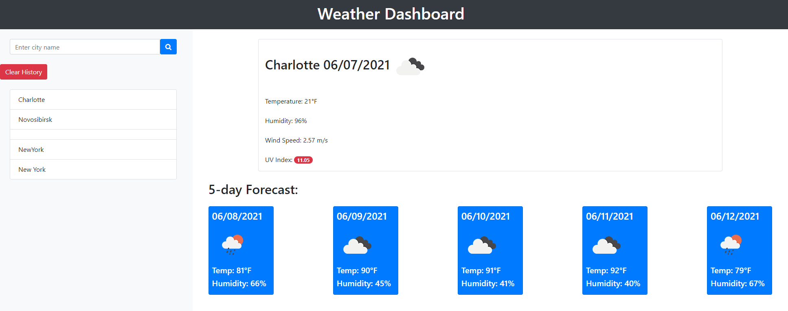

   <h1>Title Name: Weather Dashboard </h1>
  
  

## Description :

Simple weather dash board alowing you to see weather for next 5 days in citys of your chousing!

   <h3>## Content :

- [Description](#description)
- [Instruction](#instructions)
- [Usage](#usage)
- [Contributers](#contributers)
- [GitHub](#GitHub)
- [Email](#mail)
</h3>

## Instruction :

run index.html

## Usage :

## Contributers : Sergey Ishimov

## GitHub : (https://github.com/Sergey-ddbug)

## Email : sishimov@gmail.com

## GitHub Link: (https://github.com/Sergey-ddbug/WeatherDashboard)

## Deployed Link: (https://sergey-ddbug.github.io/WeatherDashboard/)

